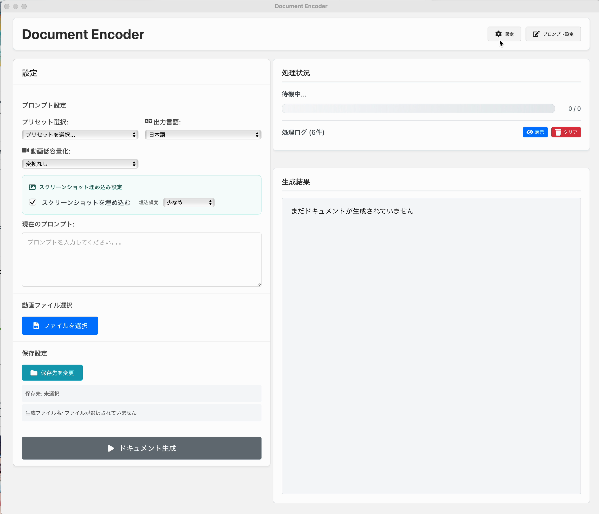
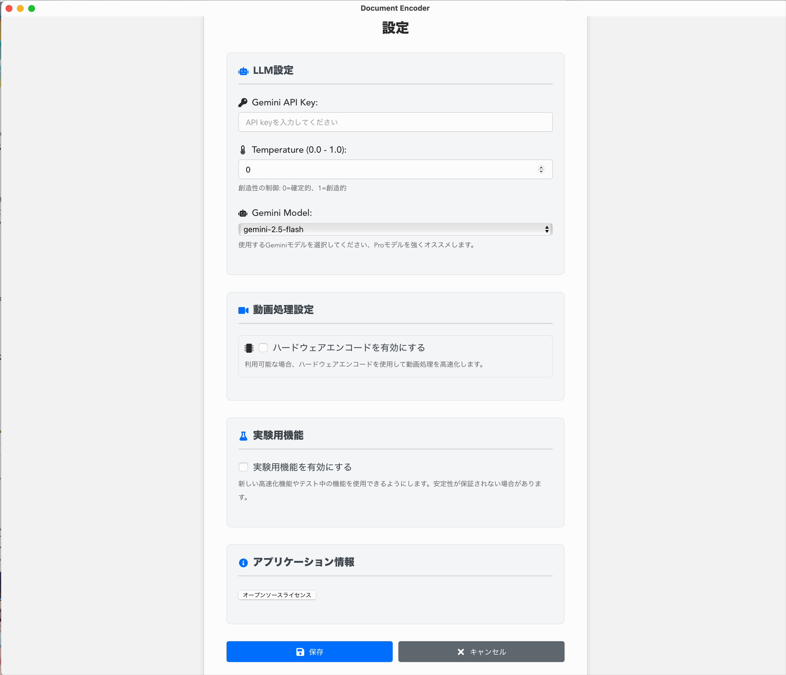
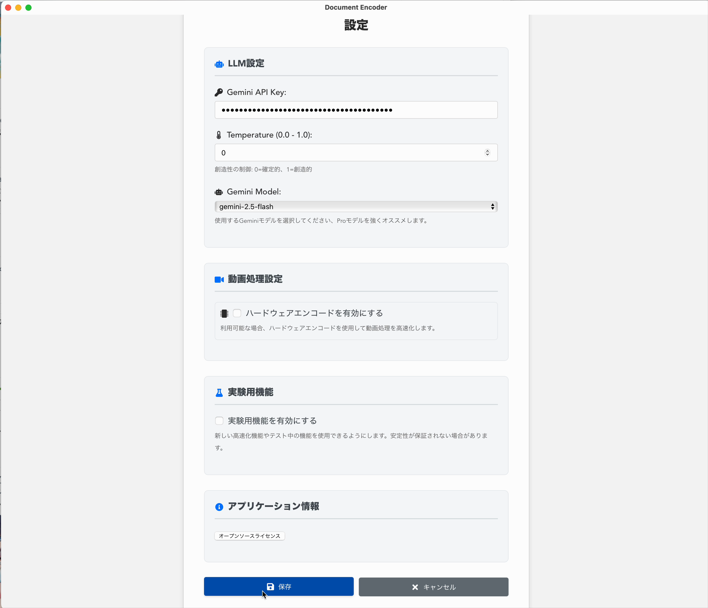
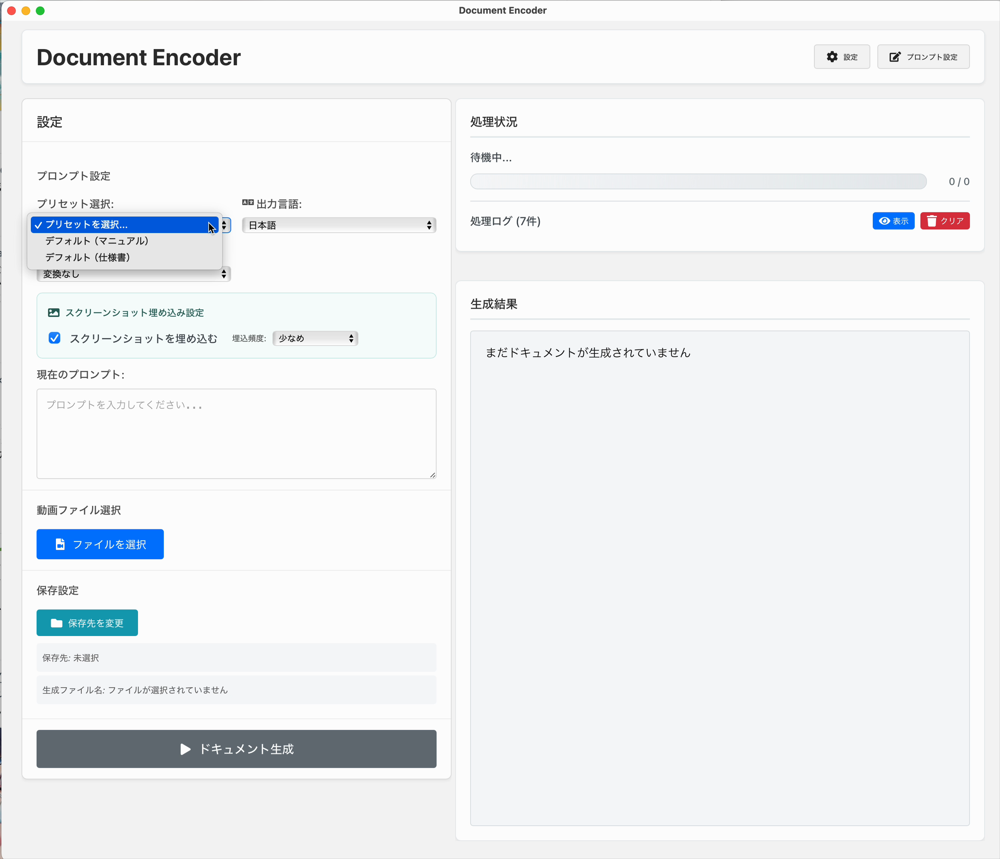
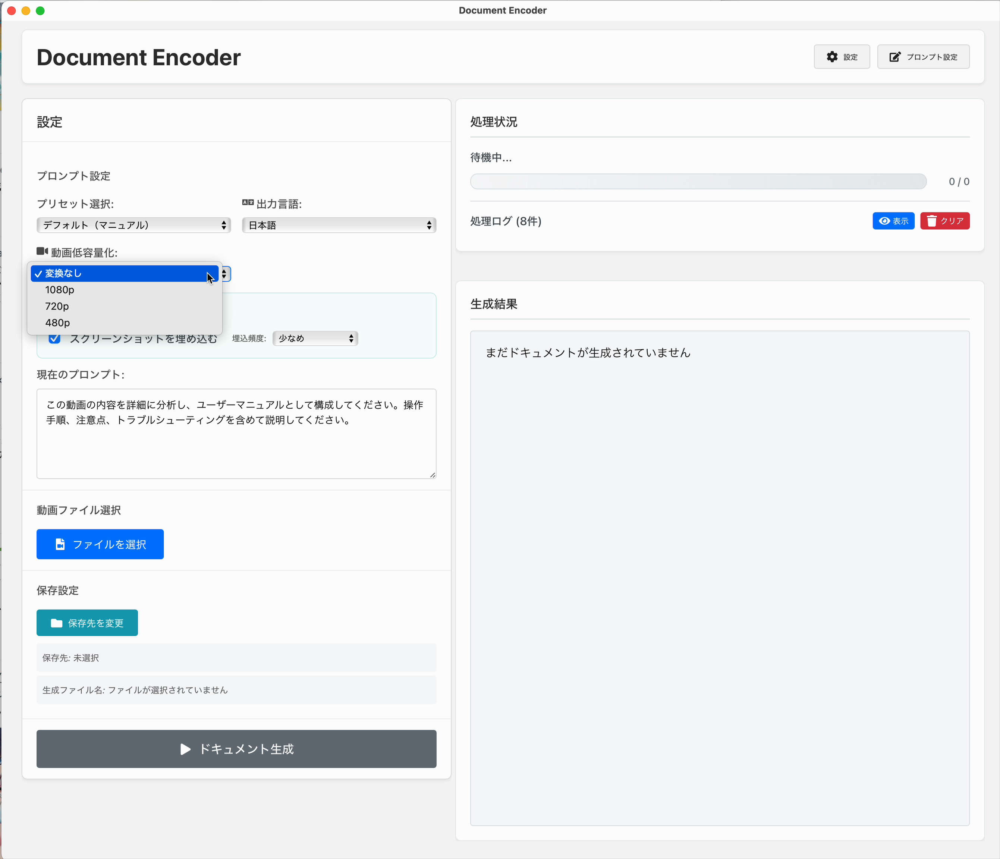
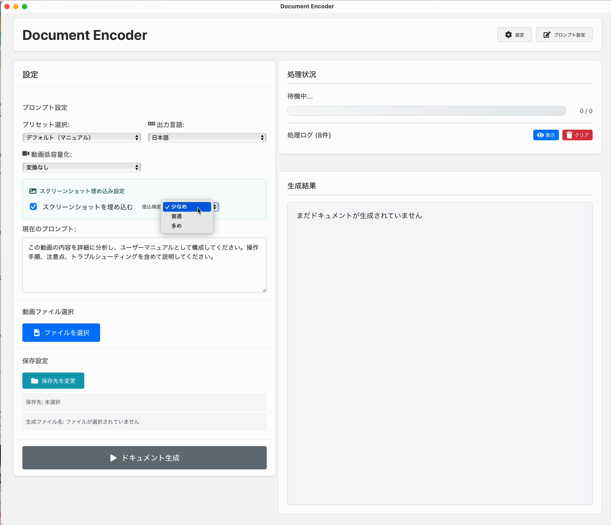
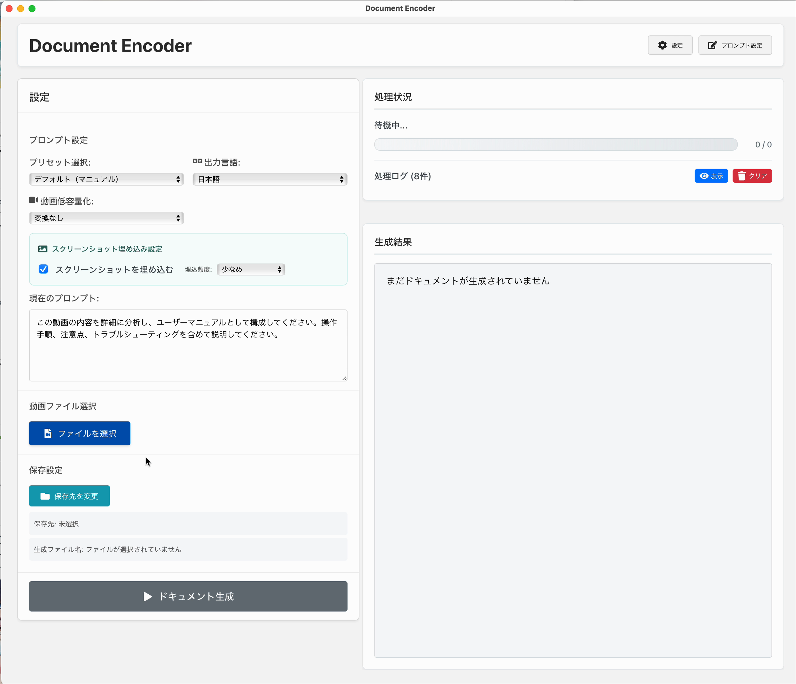
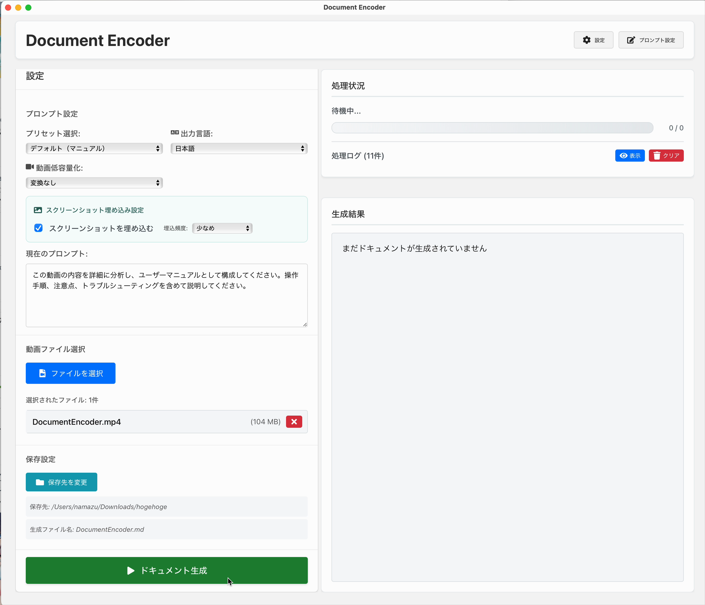
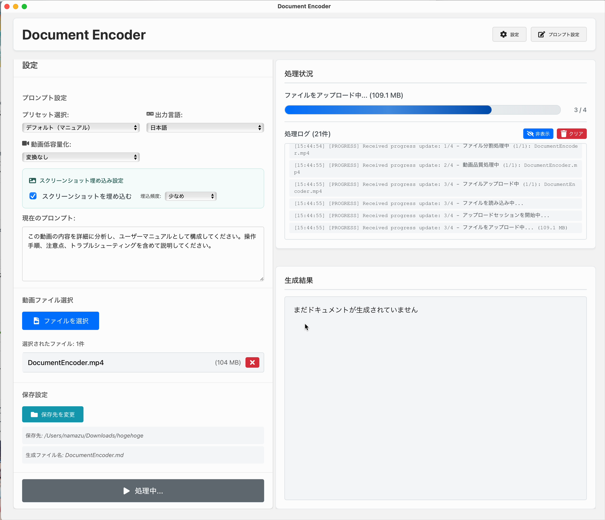
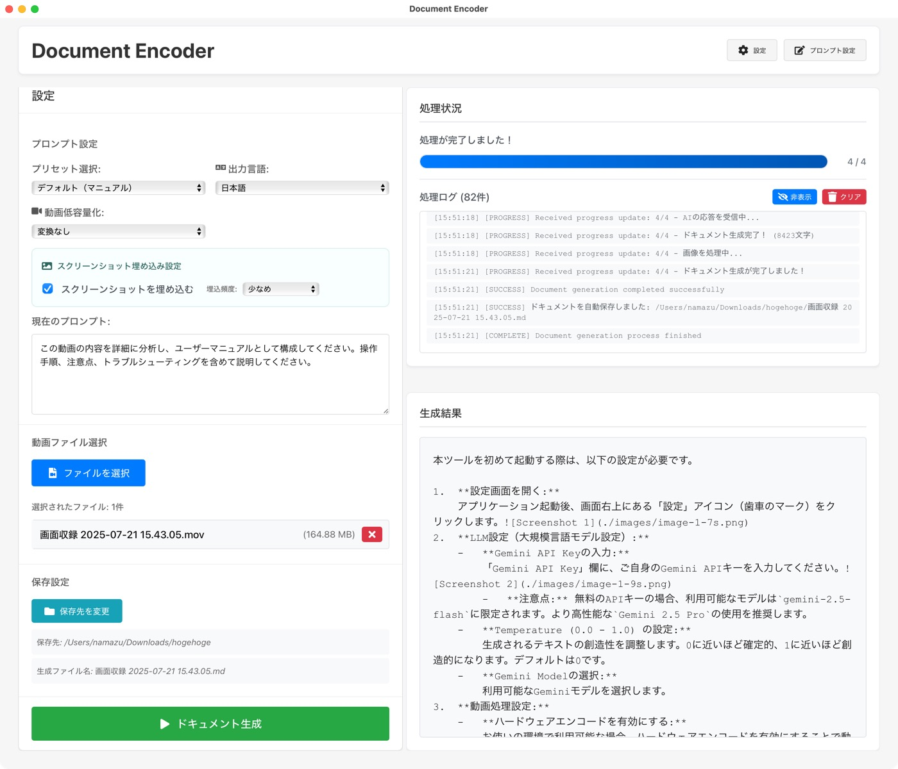

# Document Encoder

動画ファイルからAI（Gemini Pro）を使ってドキュメント（マニュアル・仕様書）を自動生成するデスクトップアプリケーションです。

**利用にはffmpegのインストールが必要です。**


## 使い方

**この使い方のDocumentは、Document Encoderで生成されています。モデルは`gemini-2.5-flash`です。**

### 1. はじめに

Document Encoderは、動画ファイルの内容を分析し、ドキュメントや仕様書などのテキスト形式の資料を自動で生成するツールです。動画内の音声や視覚情報（スクリーンショット）を基に、指定されたプロンプトに従ってテキストを生成します。

### 2. 初期設定

本ツールをはじめて起動する際は、以下の設定が必要です。

1.  **設定画面を開く:**
    アプリケーション起動後、画面右上にある「設定」アイコン（歯車のマーク）をクリックします。
2.  **LLM設定（大規模言語モデル設定）:**
    -   **Gemini API Keyの入力:**
        「Gemini API Key」欄に、ご自身のGemini APIキーを入力してください。
        -   **注意点:** 無料のAPIキーの場合、利用可能なモデルは`gemini-2.5-flash`に限定されます。業務用や仕様書用途ではより高性能な`Gemini 2.5 Pro`の使用を推奨します。
    -   **Temperature (0.0 - 1.0) の設定:**
        生成されるテキストの創造性を調整します。0に近いほど確定的、1に近いほど創造的になります。デフォルトは0です。
    -   **Gemini Modelの選択:**
        利用可能なGeminiモデルを選択します。
3.  **動画処理設定:**
    -   **ハードウェアエンコードを有効にする:**
        お使いの環境で利用可能な場合、ハードウェアエンコードを有効にすることで動画処理が高速化されます。
4.  **実験用機能:**
    -   **実験用機能を有効にする:**
        新しい高速化機能やテスト中の機能を使用できるようになります。ただし、動作確認はほぼしていません。
5.  **設定の保存:**
    全ての入力が完了したら、画面下部の「保存」ボタンをクリックして設定を保存します。

### 3. ドキュメント生成手順

初期設定が完了したら、以下の手順でドキュメントを生成します。

1.  **プロンプト設定:**
    -   **プリセット選択:**
        ドロップダウンメニューから生成したいドキュメントの種類に応じたプリセットを選択します。
        -   現在、「デフォルト（マニュアル）」と「デフォルト（仕様書）」の2種類が用意されています。
        -   プロンプトはほしいドキュメントに応じて変更してください。
        -   プリセットは「プロンプト設定」の画面で追加、エクスポート、インポートが可能です。
    -   **出力言語:**
        生成されるドキュメントの言語を選択します。現在、日本語と英語に対応しています。
    -   **動画低容量化:**
        非常に大きな容量の動画（例：4K動画）を処理する場合、ここで動画の解像度を下げることができます。
        -   オプション: 「変換なし」「1080p」「720p」「480p」
        -   **注意点:** 通常のフルHD動画であれば「変換なし」で問題ありません。
    -   **スクリーンショット埋め込み設定:**
        -   **スクリーンショットを埋め込む:**
            このチェックボックスをオンにすると、生成されるドキュメントの要所に動画のスクリーンショットが埋め込まれます。
        -   **埋め込み頻度:**
            スクリーンショットの埋め込み頻度を「少なめ」「普通」「多め」から選択できます。
            -   **推奨:** 長尺の動画の場合は「少なめ」を、短尺の動画の場合は「普通」を選択することをお勧めします。
    -   **現在のプロンプト:**
        選択したプリセットに応じたプロンプトが自動入力されます。必要に応じて、ここで手動でプロンプトを編集し、生成内容をより詳細に指示することができます。

2.  **動画ファイルの選択:**
    -   「ファイルをファイルを選択」ボタンをクリックし、ドキュメントを生成したい動画ファイルを選択します。
    -   選択後、ファイル名と容量が画面に表示されます。

3.  **保存設定:**
    -   デフォルトでは、選択した動画ファイルと同じ場所にMarkdown形式のドキュメントと、関連する画像ファイルが生成されます。
    -   保存先を変更したい場合は、「保存先を変更」ボタンをクリックして任意の場所を指定してください。

4.  **ドキュメント生成の実行:**
    -   全ての準備が整ったら、画面下部の「ドキュメント生成」ボタンをクリックします。

### 4. 処理状況と結果の確認

「ドキュメント生成」ボタンをクリックすると、処理が開始されます。

1.  **処理状況:**
    -   選択した動画ファイルがアップロードされ、Gemini APIに送信されます。
    -   「処理状況」セクションには、ファイルアップロードの進捗や、Gemini APIによる動画処理の確認状況がログとして表示されます。
    -   **注意点:** 長尺の動画の場合、処理完了までの確認時間が長くなることがあります。
    -   今回の例では、約30分の動画で約4分で処理が完了しました。
2.  **生成結果:**
    -   処理が完了すると、「生成結果」セクションに生成されたMarkdownドキュメントのプレビューが表示されます。
    -   生成されたドキュメントと画像は、指定した保存先に保存されます。

### 5. 注意点

*   **APIキーについて:** Gemini APIの利用には料金が発生する場合があります。Google Cloudの料金体系をご確認ください。
*   **動画の長さと処理時間:** 動画が長尺になるほど、処理にかかる時間も長くなります。
*   **スクリーンショットの品質と量:** 動画の解像度や埋め込み頻度によっては、生成されるドキュメントのファイルサイズが大きくなる場合があります。
*   **プロンプトの重要性:** 期待するドキュメントを生成するためには、適切なプロンプトの設定が非常に重要です。

## 主な機能

- **動画からのドキュメント生成**: 複数の動画ファイル（.mp4, .movなど）を選択し、ドキュメントを生成します。
- **2つの生成モード**:
    - **マニュアルモード**: 動画の内容を手順や操作方法として解説します。
    - **仕様書モード**: 動画の内容を機能や動作の仕様として記述します。
- **多言語対応**: 生成するドキュメントの言語を日本語または英語から選択できます。
- **長時間動画のサポート**: 1時間を超える動画は自動的に分割して処理されます。
- **進捗表示**: ファイル処理、アップロード、ドキュメント生成の進捗がリアルタイムで表示されます。

## 技術スタック

- **フレームワーク**: [Tauri](https://tauri.app/)
- **フロントエンド**: [React](https://react.dev/), [TypeScript](https://www.typescriptlang.org/)
- **バックエンド**: [Rust](https://www.rust-lang.org/)
- **外部API**: [Google Gemini API](https://ai.google.dev/)
- **動画処理**: `ffmpeg`, `ffprobe`

## 開発環境のセットアップ

### 推奨IDE

- [VS Code](https://code.visualstudio.com/) + [Tauri](https://marketplace.visualstudio.com/items?itemName=tauri-apps.tauri-vscode) + [rust-analyzer](https://marketplace.visualstudio.com/items?itemName=rust-lang.rust-analyzer)

### コマンド

```bash
# 依存関係のインストール
npm install

# 開発サーバーの起動
npm run tauri dev

# アプリケーションのビルド
npm run tauri build
```

## ライセンス

このプロジェクトは[MITライセンス](LICENSE)の下で公開されています。
